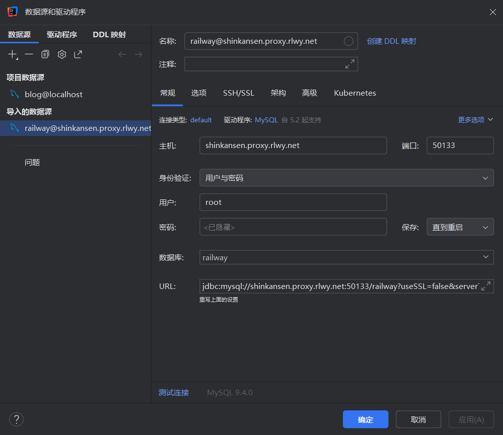
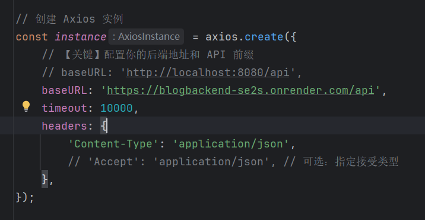

# Cloudeflare+Render+Railway全免费部署

# 1.部署mysql(Railway部署)

通过railway部署mysql数据库，在railway中的面板中创建表比较麻烦，可以先建数据库，具体表的设计先不填，后续通过sql语句进行操作。

创建成功后注意几个关键值替换本地数据库的值，替换方式如下：


其中需要的值可以在下图中对应获取：


进行完上述操作后可以用idea配置连接数据库，之后可以在console中对数据库表进行操作



理论上来说，进行完上述操作后，就成功将远程的mysql数据库连接到本地项目。

# 2.部署springboot(Render部署)

部署完数据库，并且在本地连接成功后，就可以进行springboot项目的部署，由于render不能直接部署java项目，但是支持docker项目的部署，所以通过docker进行部署springboot项目。

创建之前需要在maven控制台将项目打包，用于获取dockerfile中的jar的名称


运行之后会在根目录的target中看到jar后缀的包


然后在项目根目录创建Dockerfile文件（没有后缀），其中第10行的blogBackend-0.0.1-SNAPSHOT.jar需要修改成对应生成的jar包名。

```dockerfile
FROM maven:3.9.9-eclipse-temurin-17 AS build
WORKDIR /app
COPY . .
RUN mvn clean package -DskipTests

FROM eclipse-temurin:17-jre-alpine
ARG PORT=8080
ENV PORT=${PORT}
# 从 build 阶段复制 jar 文件到 /app/app.jar
COPY --from=build /app/target/blogBackend-0.0.1-SNAPSHOT.jar /app/app.jar
EXPOSE 8080
CMD ["sh", "-c", "java -jar /app/app.jar --server.port=${PORT}"]

```

做完上述步骤之后，将项目文件同步到github上，然后通过render创建新的web service项目


理论上来说，能够部署成功。部署成功后会得到一个请求路径

# 3.部署vue项目(Clouderflare部署)

这个比较简单，只需要用vue脚手架生成一个项目，共享到github上，再通过Cloudeflare就能直接部署到网站上。

将前端请求路径由原本的本地路径改为网络请求路径



如果第一次请求超时，可以将timeout的时间拉长，因为第一部署的springboot请求比较慢，后续可以改回来。